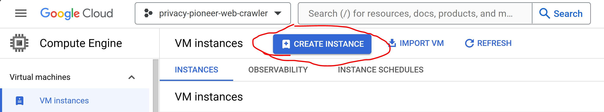

<p align="center">
  <a href="https://github.com/privacy-tech-lab/privacy-pioneer-web-crawler/releases"></a>
  <a href="https://github.com/privacy-tech-lab/privacy-pioneer-web-crawler/releases"></a>
  <a href="https://github.com/privacy-tech-lab/privacy-pioneer-web-crawler/commits/main"></a>
  <a href="https://github.com/privacy-tech-lab/privacy-pioneer-web-crawler/issues"></a>
  <a href="https://github.com/privacy-tech-lab/privacy-pioneer-web-crawler/issues?q=is%3Aissue+is%3Aclosed"></a>
  <a href="https://github.com/privacy-tech-lab/privacy-pioneer-web-crawler/watchers"></a>
  <a href="https://github.com/privacy-tech-lab/privacy-pioneer-web-crawler/stargazers"></a>
  <a href="https://github.com/privacy-tech-lab/privacy-pioneer-web-crawler/network/members"></a>
  <a href="https://github.com/sponsors/privacy-tech-lab"></a>
</p>

<p align="center">

</p>

# Privacy Pioneer Web Crawler

This repo contains a web crawler for detecting websites' data collection and sharing practices at scale. The analysis logic is based on the codebase of [Privacy Pioneer](https://github.com/privacy-tech-lab/privacy-pioneer). However, it is not necessary to work with this codebase unless you would like to make [changes to the privacy analysis or other parts of the extension for your crawl](#6-changing-the-extension-for-a-crawl). The crawler makes use of [Selenium](https://www.selenium.dev/) for browser automation.

The code in this repo is developed and maintained by the [Privacy Pioneer team](https://github.com/privacy-tech-lab/privacy-pioneer#privacy-pioneer).

[1. Research Publications](#1-research-publications)  
[2. Analyzing Websites from Different Geographic Locations](#2-analyzing-websites-from-different-geographic-locations)  
[3. Instructions for Creating a New VM on Google Cloud](#3-instructions-for-creating-a-new-vm-on-google-cloud)  
[4. Instructions for Setting up the Crawler on Windows](#4-instructions-for-setting-up-the-crawler-on-windows)  
[5. Instructions for Running the Crawler](#5-instructions-for-running-the-crawler)  
[6. Changing the Extension for a Crawl](#6-changing-the-extension-for-a-crawl)  
[7. Porting Changes from Privacy Pioneer to the Privacy Pioneer Web Crawler](#7-porting-changes-from-privacy-pioneer-to-the-privacy-pioneer-web-crawler)  
[8. Known Issues](#8-known-issues)  
[9. Thank You!](#9-thank-you)

## 1. Research Publications

You can find a list of our research publications in the [Privacy Pioneer repo](https://github.com/privacy-tech-lab/privacy-pioneer?tab=readme-ov-file#1-research-publications).

## 2. Analyzing Websites from Different Geographic Locations

We are running our crawler in different geographic locations with the goal of investigating how websites react to privacy laws from different countries and regions. To access sites from different locations it is generally possible to use a VPN, Web Proxy, or VM. We provide [instructions for setting up the crawler on a VM](#3-instructions-for-creating-a-new-vm-on-google-cloud) using [Google Cloud](https://cloud.google.com/). Using a cloud setup can mitigate some of the [challenges we encountered with VPNs](#81-gps-coordinates-and-zip-codes-when-using-vpns). We will also outline the steps to install the crawler locally. If you are **not** planning to crawl on the cloud, feel free to skip to the [crawler setup](#4-instructions-for-setting-up-the-crawler-on-windows).

## 3. Instructions for Creating a New VM on Google Cloud

This section will outline the necessary steps to create a VM on Google Cloud. You will need to create a project in the [Google console](https://console.cloud.google.com/). Unless otherwise specified, leave each setting at its default value. **Click the triangles next to the step number to see an example of what you should see at each step.**

<details>
<summary>1. Navigate to the Compute Engine and click Create Instance.</summary>

</details>
<details>
<summary>2. Choose the name, region, and zone for your machine. Your decision should reflect what location you would like to crawl from.</summary>

</details>
<details>
<summary>3. Select the appropriate type of machine you would like to use. If you are on the fence about whether or not your machine will be powerful enough, it is better to overestimate. We have had issues with weaker machines where Selenium stopped working when a machine ran out of memory.</summary>

</details>
<details>
<summary>4. Change the server boot disk to Windows. In theory, there is no reason why you could not run this crawler on a Linux server. However, we have not tested this, and we recommend the Windows route because you have <a href="https://github.com/privacy-tech-lab/privacy-pioneer-web-crawler?tab=readme-ov-file#82-connecting-to-cloud-vms-using-a-gui">easy access to a GUI</a>. This makes checking if the crawler is operating as expected significantly easier.</summary>


</details>
<details>
<summary>5. Allow HTTP and HTTPS messages through the firewall. Then, click "Create."</summary>

</details>
<details>
<summary>6. Now that you have your server, click on the triangle next to "RDP" and select "Set Windows Password." Be sure to save these credentials somewhere safe as <strong>they will not be shown again</strong>.</summary>

</details>

You should now have a working Google Cloud VM. To connect to the VM, use the Remote Desktop Connection app on Windows, which should be installed by default. Provide the external IP, username, and password. After connecting, you should see the server desktop. Next, you will need to go through the [crawler setup instructions](#4-instructions-for-setting-up-the-crawler-on-windows).

**Note:** When crawling with multiple locations, you can avoid the hassle of setting up each VM individually by using a [machine image](https://cloud.google.com/compute/docs/machine-images).

## 4. Instructions for Setting up the Crawler on Windows

The previous steps were getting you ready to deploy the crawler on the cloud. Now, we will actually be setting up the crawler. This process is identical locally and on the cloud.

### 4.1 Browser and Crawler Installation

To install the browser and crawler do the following:

1. Install [Firefox Nightly](http://ftp.mozilla.org/pub/firefox/nightly/2024/01/2024-01-01-23-15-40-mozilla-central/).

   **Important Note**: While downloading the [latest version](https://www.mozilla.org/en-US/firefox/channel/desktop/) of Nightly does work, testing the crawler has revealed that certain versions of Firefox Nightly break the ability to add monetization labels. We recommend downloading the version we have linked above and [disabling automatic updates](https://winaero.com/disable-updates-firefox-63-above/). This will also help achieve more consistent results across different runs.

   **Note**: In addition to using a specific version of Firefox Nightly, we will also be disabling the [Enhanced Tracking Protection](https://support.mozilla.org/en-US/kb/enhanced-tracking-protection-firefox-desktop) that Firefox provides us with. Besides just providing us with additional data, this will also help ensure that Privacy Pioneer is operating as expected.

2. Then, clone this repo with:

   ```bash
   git clone https://github.com/privacy-tech-lab/privacy-pioneer-web-crawler.git
   ```

   If you want to make changes to the Privacy Pioneer extension for the crawl, check out our [guide for changing Privacy Pioneer](#6-changing-the-extension-for-a-crawl). If you want to use the extension as is, you can skip the guide.

### 4.2 MySQL Installation and Setup

We are using a MySQL database to store analysis results. To install and set up MySQL server and MySQL shell do the following:

1. [Install MySQL server](https://dev.mysql.com/downloads/installer/).
2. [Install MySQL shell](https://dev.mysql.com/doc/mysql-shell/8.0/en/mysql-shell-install.html).

3. Once installed, open the MySQL Shell and run the following commands:

   ```bash
   \connect root@localhost
   ```

   Enter your MySQL root password. If you have not set this up yet, the shell should prompt you to create one. You can use a simple password like `abc` if you are just working with a local MySQL instance.

   Next, switch the shell over from JS to SQL mode.

   ```bash
   \sql
   ```

4. To set up the crawler for accessing the database via your root account run in the MySQL Shell:

   ```sql
   ALTER USER 'root'@'localhost' IDENTIFIED WITH 'mysql_native_password' BY 'abc';
   ```

   ```sql
   FLUSH PRIVILEGES;
   ```

5. If you do not have a password for MySQL and the MySQL Shell did not prompt you to create one, you can run the following command in the MySQL Shell:

   ```sql
   ALTER USER 'root'@'localhost' IDENTIFIED BY 'abc';
   ```

   ```sql
   FLUSH PRIVILEGES;
   ```

### 4.3 Database Setup

Next, we will set up the MySQL database. This is important because we need a place to store the [evidence](https://github.com/privacy-tech-lab/privacy-pioneer?tab=readme-ov-file#7-privacy-practice-analysis) that Privacy Pioneer will collect. Interactions with the database will be managed by the scripts located in the [rest-api](https://github.com/privacy-tech-lab/privacy-pioneer-web-crawler/tree/main/rest-api) directory.

1. First, in the MySQL shell, create the database:

   ```sql
   CREATE DATABASE analysis;
   ```

2. Then, access it:

   ```sql
   USE analysis;
   ```

3. Lastly, create two tables where any evidence that Privacy Pioneer collects will be stored. The `entries` table contains any evidence that Privacy Pioneer is able to find. The `allEv` table contains all requests that Privacy Pioneer examined while the crawler was running.

   ```sql
   CREATE TABLE entries
      (id INTEGER PRIMARY KEY AUTO_INCREMENT, timestp varchar(255), permission varchar(255), rootUrl varchar(255),
      snippet varchar(4000), requestUrl mediumtext, typ varchar(255), ind varchar(255), firstPartyRoot varchar(255),
      parentCompany varchar(255), watchlistHash varchar(255),
      extraDetail varchar(255), cookie varchar(255), loc varchar(255));
   ```

   ```sql
   CREATE TABLE allEv
   (id INTEGER PRIMARY KEY AUTO_INCREMENT, rootUrl varchar(255), request text(100000));
   ```

   You can now exit the MySQL shell.

4. In the [rest-api](https://github.com/privacy-tech-lab/privacy-pioneer-web-crawler/tree/main/rest-api) folder, create a new file called `.env`, and save the following to that file:

   ```bash
   DB_CONNECTION=mysql
   DB_HOST=localhost
   DB_DATABASE=analysis
   DB_USERNAME=root
   DB_PASSWORD=abc
   ```

### 4.4 Crawler Setup

Lastly, manually set the ZIP code and the GPS coordinates that you will be crawling from. While the Privacy Pioneer extension is able to automatically infer users' locations from their IP addresses, this [approach proved to be error-prone](#81-gps-coordinates-and-zip-codes-when-using-vpns) when performing automated crawls from multiple locations.
You can make the change by opening up the [local crawler script `local-crawler.js`](https://github.com/privacy-tech-lab/privacy-pioneer-web-crawler/blob/main/selenium-crawler/local-crawler.js) and modifying the following values:

```js
const TARGET_LAT = 41.5569; // replace this value with your intended latitude
const TARGET_LONG = -72.6652; // replace this value with your intended longitude
const TARGET_ZIP = "06457"; // replace this value with your intended ZIP code (note that it must be a string)
```

## 5. Instructions for Running the Crawler

### 5.1 Installation and Start

Now, it is time to run the crawler:

1. First, using the terminal, go to the `privacy-pioneer-web-crawler/rest-api` directory. Run either:

   ```bash
   npm install
   node index.js
   ```

   or

   ```bash
   npm install
   npm start
   ```

2. Second, in another instance of the terminal, go to the `privacy-pioneer-web-crawler/selenium-crawler` directory. Run either:

   ```bash
   npm install
   node local-crawler.js
   ```

   or

   ```bash
   npm install
   npm start
   ```

The crawler should now be running. You will know the crawler is running when an instance of Firefox Nightly opens up and your desktop looks as follows:


**Note**: The sites the crawler will crawl are in the [`privacy-pioneer-web-crawler/selenium-crawler/crawl-lists` directory](https://github.com/privacy-tech-lab/privacy-pioneer-web-crawler/tree/main/selenium-crawler/crawl-lists) of this repo.

### 5.2 Optional Arguments for the Crawler

We also provide the user with optional arguments to speed up certain tasks. These are extra arguments passed via the command line with examples below. All of these arguments can be combined or used by themselves.

`test` - Launches the crawler in Test Mode. With this mode enabled, the crawler will only crawl one site (the first in the list) and stay on the site indefinitely. This version will also launch with the Firefox DevTools opened by default, thereby simplifying ground truth analysis.

```bash
npm start test
```

`state/country_name` - Supplying a location name from the list provided in **/selenium-crawler/constants.js** will automatically select the correct hard-coded values for you.

```bash
npm start iowa
```

`site=[index]` - The index from the crawl list that you'd like to start from.

```bash
npm start site=99 # This would start the crawl on the 100th site in the list
```

### 5.3 Optional Arguments for the REST-API

Here are some helpful arguments you can pass when starting the backend.

`wipe` - Truncates the SQL Tables associated with the API. Useful when you want to quickly delete all data in your database without doing so manually.

```bash
npm start wipe
```

## 6. Changing the Extension for a Crawl

In case you should need it, here are the steps to make changes to [Privacy Pioneer](https://github.com/privacy-tech-lab/privacy-pioneer) that will be reflected when you perform your crawl.

1. Clone the Privacy Pioneer repo and make any changes that you would like to the local files.

   **Note**: If you change Privacy Pioneer and make your own version of the crawler, then you will need to remember to enable "crawl mode" within the extension source code. The instructions for doing so can be found in the [comments of Privacy Pioneer's background.js](https://github.com/privacy-tech-lab/privacy-pioneer/blob/main/src/background/background.js). The gist is that you will need to set the flag `IS_CRAWLING` to `true`. If you are testing changes to the crawler, you will also need to set the `IS_CRAWLING_TESTING` flag to `true`. `IS_CRAWLING` will enable posting to the `entries` table as well as enabling the aforementioned manual [location override](#44-crawler-setup). `IS_CRAWLING_TESTING` will enable posting to the `allev` table. This is necessary so that functionality related to setting the location data and recording crawl data are enabled.

2. Once the changes have been made, run from within the `privacy-pioneer` directory:

   ```bash
   npm run build
   ```

3. Navigate to the newly made `dev` directory.
4. In the `manifest.json` file, add the following code at the bottom (within the json). Firefox will not let you add an extension without this ID.

   ```json
   "browser_specific_settings": {
       "gecko": {
         "id": "{daf44bf7-a45e-4450-979c-91cf07434c3d}"
       }
     }
   ```

5. Within the `dev` directory, send all the files to a zip file.
6. Rename the file extension from `.zip` to `.xpi`. Functionally, these files will behave the same. The xpi format is the format that Firefox uses to load an extension.
7. Place this new file into the `selenium-crawler` directory, and modify the crawler accordingly. Make sure that the aforementioned `local-crawler.js` file is looking for the correct extension, i.e.:

   ```js
   .addExtensions("ext.xpi");
   ```

   is pointing to the right xpi file.

## 7. Porting Changes from Privacy Pioneer to the Privacy Pioneer Web Crawler

The Privacy Pioneer Web Crawler makes use of [Privacy Pioneer's extension codebase](https://github.com/privacy-tech-lab/privacy-pioneer). Thus, when we make changes to the extension, it may be necessary to port those to the crawler. This is particularly true for changes to the privacy analysis functionality. Porting such functionality is a manual process. It requires manually recompilation of the extension and replacement of the old extension file, i.e., `privacy-pioneer-web-crawler/selenium-crawler/ext.xpi`. If you make any changes to the extension code that should be reflected in the crawler, follow the steps outlined below. Also, check the previous section in this readme for additional assistance.

1. After you have made any changes to Privacy Pioneer's extension codebase that should be ported to the crawler, be sure to switch the appropriate Boolean flag for the desired crawl mode. These flags are located in `/src/background/background.js`.

   - If you only want to record all evidence data, then set `IS_CRAWLING` to `true`.
   - If you also want to record all requests that Privacy Pioneer looks at, set `IS_CRAWLING_TESTING` to `true` as well.

2. Next, run the following command from within the `privacy-pioneer` folder:

   ```bash
   npm run build
   ```

3. Navigate to the newly created `dev` directory. Within this directory, there should be a new `manifest.json` file. Open this file and paste the following code (within the JSON). Firefox will not allow you to add an extension to the crawler without this ID.

   ```json
   "browser_specific_settings": {
    "gecko": {
      "id": "{daf44bf7-a45e-4450-979c-91cf07434c3d}"
    }
   }
   ```

4. Take all of the files within the `dev` directory and add them to a zip file. You can either do this through a GUI or through the command line. If done through a GUI, make sure that you change the file format from `.zip` to `.xpi`. Functionally, these files will behave the same. The xpi format is the format that Firefox uses to load an extension. Here is the relevant code:

   ```bash
   zip -r ext.xpi ./
   ```

5. Now, to update the extension file in the crawler repo, place your new `ext.xpi` file into the `privacy-pioneer-web-crawler/selenium-crawler/` directory and create a pull request as necessary.

## 8. Known Issues

We are aware of various issues:

### 8.1 GPS Coordinates and ZIP Codes when Using VPNs

Our use of Google Cloud was primarily motivated by this issue. As described in the [Privacy Pioneer repo](https://github.com/privacy-tech-lab/privacy-pioneer?tab=readme-ov-file#7-privacy-practice-analysis), the extension is meant to find evidence of location elements being collected and shared. However, when using a VPN (or any service without a static IP), it becomes nearly impossible for Privacy Pioneer to find evidence of GPS locations and ZIP codes. This is due to how Privacy Pioneer decides where the user's [location](https://developer.mozilla.org/en-US/docs/Web/API/Geolocation_API) is, and so there will almost certainly be a discrepancy between where Privacy Pioneer thinks the user is, and where a website thinks the user is. Since these features are built-in to the extension, it would be difficult to make Privacy Pioneer work with a VPN crawl without significant changes to the architecture. Thus, we have opted to hard-code the latitude, longitude, and ZIP code for our crawls. For instructions on how to do this, check [the crawler setup](#44-crawler-setup).

### 8.2 Connecting to Cloud VMs Using a GUI

Currently, the only way to actually see the GUI is through the Remote Desktop Connection app on Windows.

### 8.3 Starting the Crawl Fails

If the crawler fails to start, simply try running it again. Firefox Nightly is updated often, which can cause it to be unstable and crash on the first boot-up. Try running the crawler in `privacy-pioneer-web-crawler/selenium-crawler` again.

### 8.4 Selenium WebDriver not using the Browser specified

If the crawler uses a browser that's in `.cache/selenium/...` instead of the binary specified in code, try to manually set `firefoxBrowserPath = "C:/Program Files/Firefox Nightly/firefox.exe"` at around line 614 in `createSession` function in `selenium-crawler/node_modules/selenium-webdriver/firefox.js`.

### 8.5. Other issues

If you encounter an issue that has not been described, try to identify if it is coming from Selenium. To accomplish this, look at any error messages in the terminal that is running in `selenium-crawler`. Make sure that you are connected to the Internet, both the crawler and extension are running, and that the crawler looks as shown [above](#44-crawler-setup).

Feel free to [open an issue](https://github.com/privacy-tech-lab/privacy-pioneer-web-crawler/issues) or contact us via email at <sebastian@privacytechlab.org>.

## 9. Thank You!

<p align="center"><strong>We would like to thank our supporters!</strong></p><br>

<p align="center">Major financial support provided by Google.</p>

<p align="center">
  <a href="https://research.google/programs-and-events/research-scholar-program/recipients/?filtertab=2022">
    
  </a>
</p>

<p align="center">Additional financial support provided by Wesleyan University and the Anil Fernando Endowment.</p>

<p align="center">
  <a href="https://www.wesleyan.edu/mathcs/cs/index.html">
    
  </a>
</p>

<p align="center">Conclusions reached or positions taken are our own and not necessarily those of our financial supporters, its trustees, officers, or staff.</p>

##

<p align="center">
  <a href="https://privacytechlab.org/"></a>
<p>
